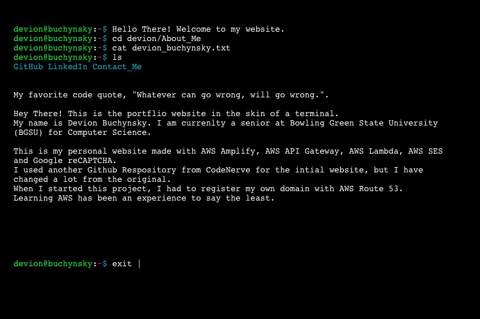

# website 
This is my personal website made with AWS Amplify. I used another Github Respository from CodeNerve for the intial website, but I have changed a lot from the original.
When I started this project, I had to register my own domain with AWS Route 53. Learning AWS has been an experience to say the least. 
CodeNerve reposittory https://github.com/CodeNerve/CodeNerve.github.io

## this is what Version 1 of the website looked like.

